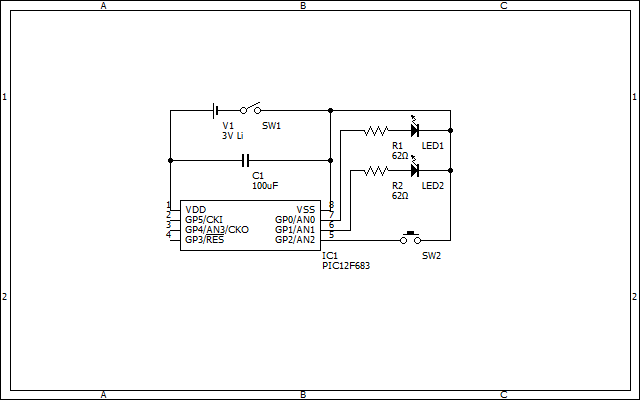

# Circuit

## List of parts

- IC1: Microchip Technology Inc. PIC12F683
- LED1, LED2: red LED
- R1, R2: resistor 62ohm
- C1: condensor 100uF
- SW1: slide switch
- SW2: momentary push switch
- V1: 3V lithium battery

## Circuit diagram

Created with [BSch3V](https://www.suigyodo.com/online/schsoft.htm).
The source of the image file is "dual-light-flasher.CE3".
